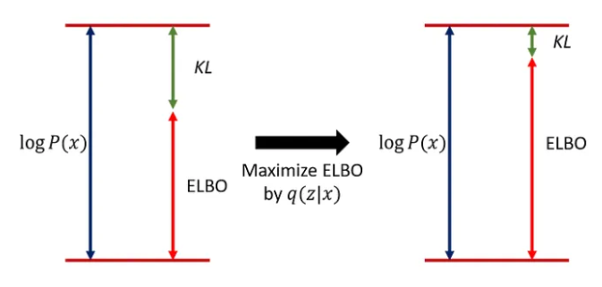
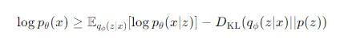
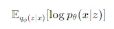
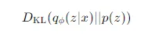

# VAE
Variational Autoencoder (VAE)

## Autoencoder
The plain and traditional autoencoder behaves somewhat similar to a file compression algorithm, where we zip and unzip a file.
The difference is that the file compression algorithm would ensure files before and after zipping are identical. However, autoencoder will suffer some losses in the network.

In a plain autoencoder, we encode some data, then decode as best as we can, as shown below. 
* cat → [1, 2, 3 …]
* dog → [1, 2.1, 3.2 …]

There are some problems:
1. For example, cat and dog could have similar results. When we decode, we could decode to a dog, when a cat is expected.
2. In other words, to enhance accuracy, we need to capture `Semantic Relationship` between data, we want data to make sense.

A variational autoencoder would solve above problems.

## Variational Autoencoder
Variational Autoencoder (VAE) is a type of generative model with the goal of learning the latent structure in data and generating similar samples. Given a set of observed variable data x, VAE aims to learn the distribution of a latent variable z, such that we can generate approximate data x' from z.
* Encoder: It takes an input `x`, and covert it to latent representation `z`. `z` is a distribution, usually a Gaussian distribution.
* Decoder: It samples a point from the distribution `z`, and attempts to reconstruct the original input `x'` as accurately as possible.

The overall concept of VAE is relatively easy to understand, with the two key components being the reparameterization and the loss function. And we will dive into them in details.

### Loss function

VAE uses `ELBO` to train and advance the model. There are two core concepts here, `Reconstruction Loss` and `KL Divergence`

#### ELBO (Evidence Lower Bound)

* Reconstruction loss

Compare the loss between generated sample p(x|z) and x

* KL Divergence

It measures the difference between q(z|x) and p(z). We wish to minimize the difference to enhance accuracy of the model. `When KL Divergence reaches 0, q(z|x) equals to p(z|x)`

#### q(z|x) and p(z)
q(z|x) and p(z) are both probability distributions, but they serve very different purposes.

- p(z). It's a `prior distribution`, representing our assumption about the distribution of the latent space, before we observe any data. We use it as a baseline distribution of the latent space, and typically assume it's N(0,1) gaussian distribution. 
- q(z|x): It's an `approximate posterior distribution` of the latent variable z, given the observed data x. It represents the learned distribution over z after observing x. It serves as a learned approximation of the `true posterior distribution` p(z|x), which is often intractable. In VAE, q(z|x) is parameterized by the encoder network. 

** Example **

Assume we train VAE to generate digits 0 to 9. 
- p(z): Before observing any data, we guess the latent distribution is a Gaussian distribution, N(0,1). It's only an assumption.
- q(z|x): If the image is 8, q(z|x) will produce a distribution in the latent space, that likely has a mean and deviation unique to 8. It is tuned to each individual image and provides more accurate and data-specific representations.

### The Reparameterization Trick
Backpropagation allows us to adjust the network’s internal parameters based on the difference between the predicted output and the actual output. However, it struggles when dealing with random sampling, which is inherent in VAEs.

Encoder generates a distribution `z` which the decoder will sample from. Then we can describe `z` as `z = random_sample(μ,σ)`, as you may have noticed, it is a random sample.

- μ: The mean value of the distribution
- σ: The standard deviation of the distribution

#### Why is random sampling non-differentiable?
The main reason lies in the nature of randomness: when we sample from a distribution (such as a Gaussian distribution), the result z is determined by a random process and is not a continuous, deterministic function of the parameters μ and σ. Randomness introduces uncontrollable fluctuations, so it's impossible to compute the partial derivatives through a deterministic mathematical expression.

For example, suppose we sample and get z1, and the next time we might get a different z2. These values are random and not differentiable functions of μ and σ, making it impossible to accurately calculate their partial derivatives with respect to μ or σ. Therefore, during the sampling step, the gradient calculation is 'broken' and cannot be properly propagated to μ and σ."

#### How to solve?
In order to allow backpropagation to work properly during the random sampling step, VAE uses the reparameterization trick. The core idea is to `reformulate` the sampling step in a differentiable way.

The specific approach is:

z=μ+σ⋅ϵ

where ϵ is a random variable sampled from the standard normal distribution N(0,1). The new formula is also a linear function, meaning it is differentiable, meaning we can compute the partial derivatives of the loss function with respect to μ and σ, allowing backpropagation to proceed as usual.

#### Goal
For the VAE example, we aim to obtain the Gaussian distribution's mean `μ` and standard deviation `σ` through the encoder, then sample a random variable `z` from this distribution. Our ultimate goal is to adjust `μ` and `σ` using backpropagation to improve the model's performance.

### Probability
Why using probability?
1. There are advantages in optimization problems, such as more easily maximizing the likelihood function of data. The maximum likelihood function is a classic statistical algorithm used to estimate the most ideal model. In VAE (Variational Autoencoder), we use ELBO (Evidence Lower Bound) to achieve this.
2. Real-world data has strong uncertainty and complexity. For instance, images, speech, and text all contain many latent variables, such as object pose, lighting, and angles. These variables are unobservable, so using probabilities can help mitigate these uncertainties.
3. In real-world data, observations are often partial or incomplete.
4. There are advantages when inferring or generating data.